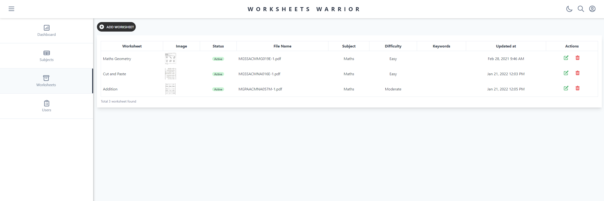
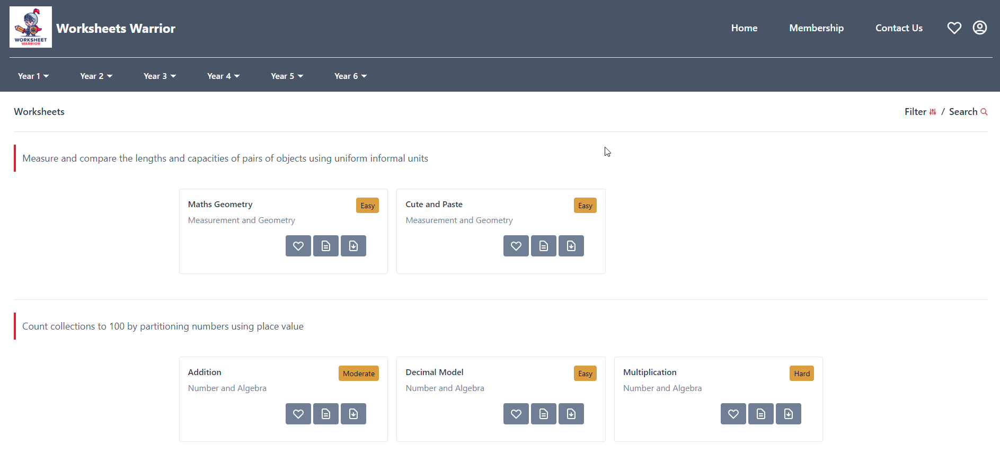

# Worksheets Warrior

The website can be accessed from [this link](http://178.128.94.112:8000)





## Getting Started

These instructions will get you a copy of the project up and running on your local machine for development and testing purposes. See deployment for notes on how to deploy the project on a live system.

### Prerequisites

npm and Node.js installed

### Installing

A step by step series of examples that tell you how to get a development env running

Installing nvm

```
curl -o- https://raw.githubusercontent.com/nvm-sh/nvm/v0.39.1/install.sh | bash
```

Installing npm modules

```
nvm install 12
nvm use 12
npm install
```

Creating uploads folder in server directory

```
mkdir public && mkdir public/uploads && mkdir public/uploads/categories && mkdir public/uploads/customize && mkdir public/uploads/worksheets && mkdir public/uploads/worksheets-images
```

Create .env in the main directory with template below (Create an account on [Braintree](https://www.braintreepayments.com/sandbox?referrer=https%3A%2F%2Fwww.google.com%2F) and [Stripe](https://stripe.com/) to get Sandbox credentials)
```
DATABASE=mongodb://localhost/ecommerce
PORT=8000
BRAINTREE_MERCHANT_ID=***
BRAINTREE_PUBLIC_KEY=***
BRAINTREE_PRIVATE_KEY=***
STRIPE_DEV_PUBLIC_KEY=***
STRIPE_DEV_SECRET_KEY=***
```

Create .env in the client directory with the template below
```
REACT_APP_API_URL=http://localhost:8000
REACT_APP_STRIPE_DEV_PUBLIC_KEY=***
```

### Running the app

Open a terminal on server directory

```
npm run start:server
```

and open another terminal on client directory
```
npm run start:client
```

### Running the tests
```
npm run test
```

### Deployment

Run these commands to build the client directory and run on the server

```
npm run build:client
npm install pm2
pm2 start server/app.js
```

### Built With

* [React](https://reactjs.org/) - The front-end web framework
* [Node.js](https://nodejs.org/en/) - JavasScript runtime
* [Express.js](https://expressjs.com/) - Node.js web application framework
* [MongoDB](https://www.mongodb.com/) - Popular document database

### Credit

Thanks to

[](https://www.youtube.com/watch?v=lXk14qt2D28)
